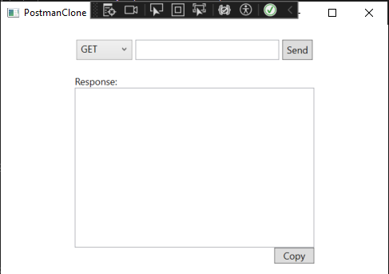
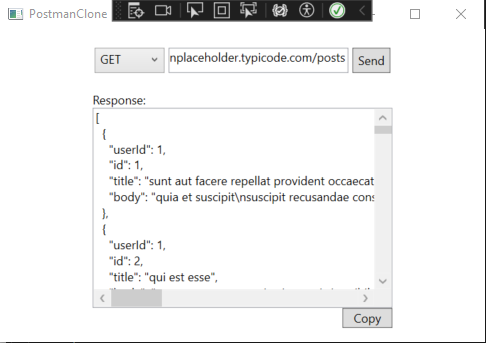

# Postman Clone 
Postman clone is a simplified and easy to use clone of Postman. This tool can make GET Requests and displays the results. 

## Technologies Used 
* C#
* .Net 7
* WPF
* HTTPClient

  ## Using The App
  1. Download the executable file from the release section.
  2. When the application launches, it should look like this:
     
     
     
  4. Fill in your API URL and hit 'SEND':
     
     

## Upcomming Updates 
1. POST
2. PATCH
3. PUT
   
